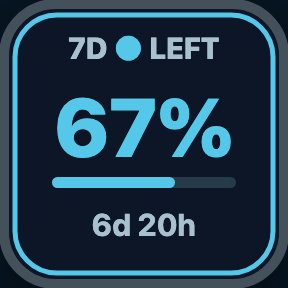
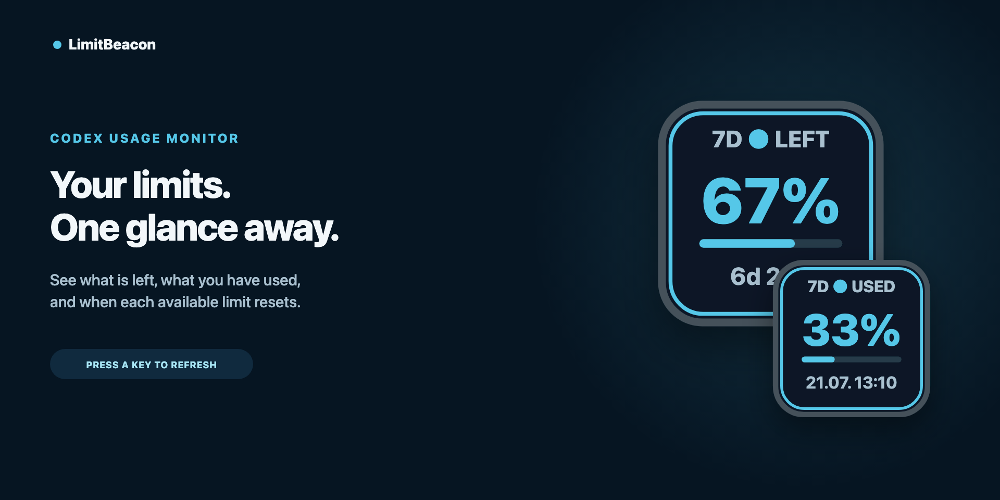
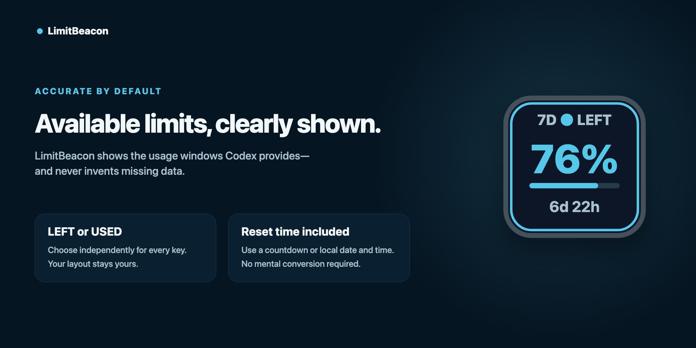
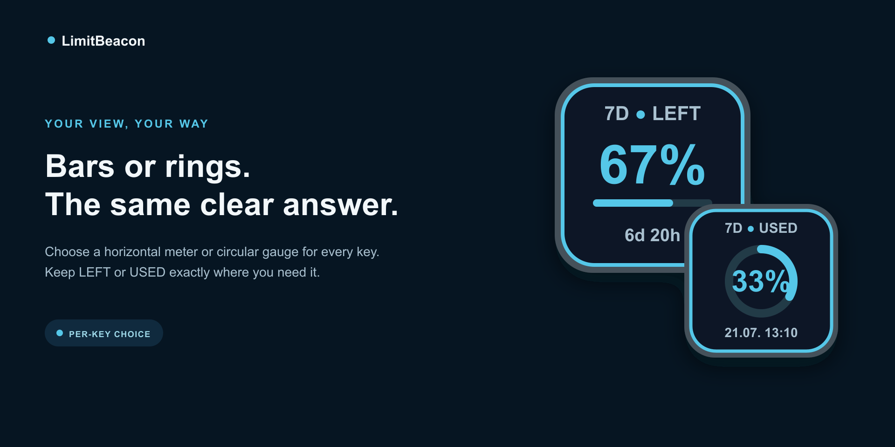
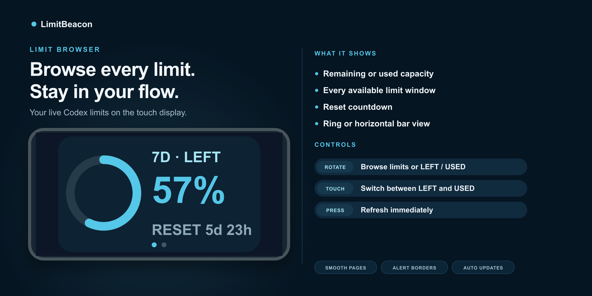
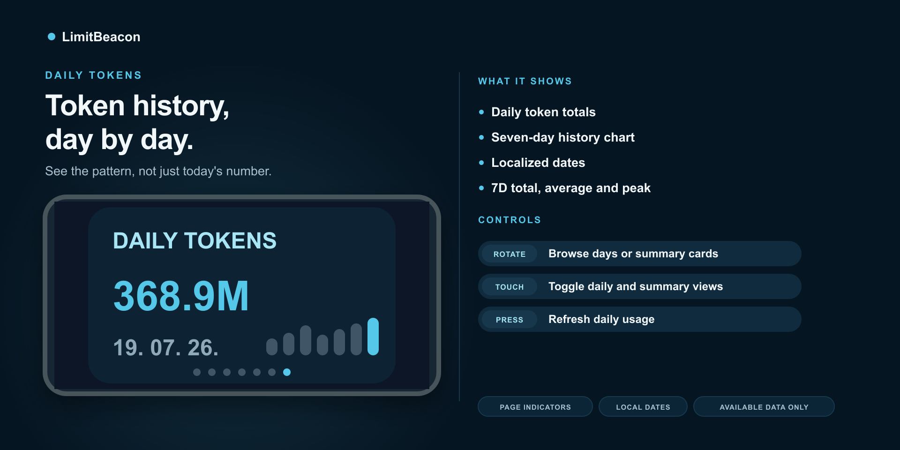
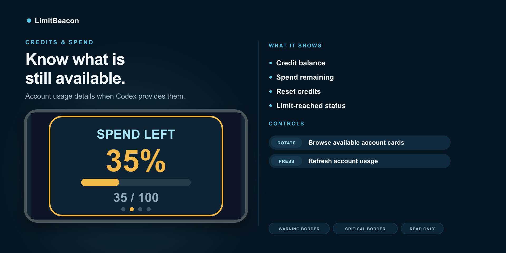
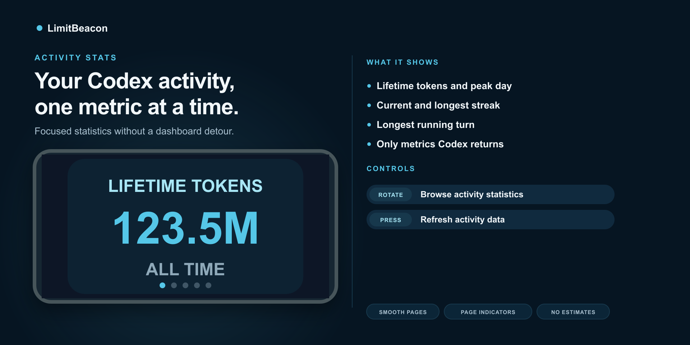
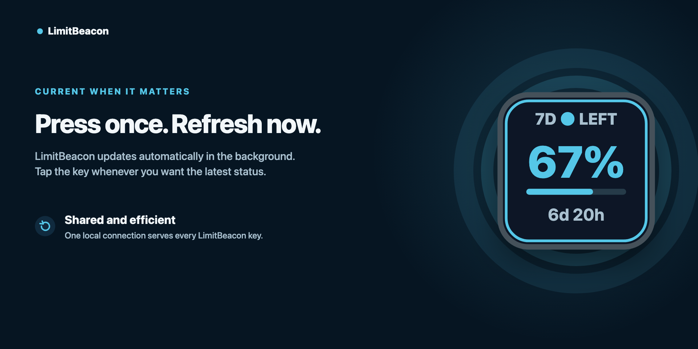
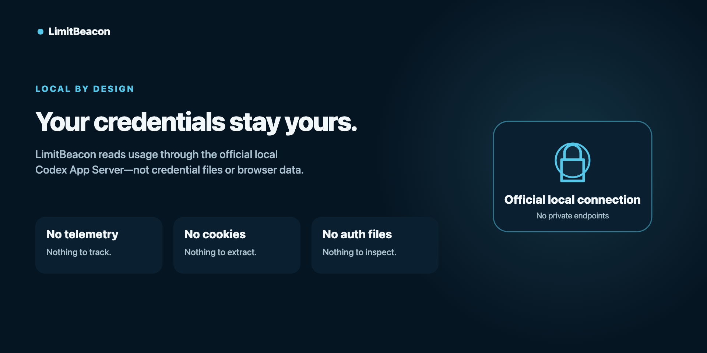

<p align="center">
  
</p>

<h1 align="center">LimitBeacon</h1>

<p align="center">
  AI Usage Monitor for Codex on Stream Deck
</p>

<p align="center">
  <a href="LICENSE">MIT License</a> · <a href="PRIVACY.md">Privacy</a>
</p>



LimitBeacon is a free, open-source Stream Deck plugin for monitoring Codex usage limits included with supported ChatGPT plans. It keeps remaining or used percentages and reset times visible while you work.

Press a key for an immediate refresh. Automatic updates, connection management, and caching are shared efficiently across every LimitBeacon key.

## What it shows

- Remaining or used percentage, configured independently per key
- Primary and secondary usage windows when Codex makes them available
- Reset countdown or local date and time
- Horizontal meters or circular gauges, selected independently per key
- Five focused actions: one key action and four Stream Deck + dial actions
- Daily token usage and activity statistics when supplied by Codex
- Credits and spend information when available for the signed-in account
- Smooth directional transitions while browsing dial cards
- Clear warning, critical, stale, loading, and sign-in states



## Choose your view

Use the compact horizontal meter or switch any key to a circular gauge. Each key keeps its own display preference, remaining or used basis, and reset-time format.



## Stream Deck + dials

LimitBeacon includes four focused Stream Deck + dial actions:

- **Limit Browser** — browse current rate-limit windows and switch between remaining and used
- **Daily Tokens** — browse daily token usage or touch the display for a compact summary
- **Credits & Spend** — browse credits, spend allowance, and reset credits when available
- **Activity Stats** — browse lifetime tokens, peak usage, streaks, and longest turn when available

Rotate any dial to browse its cards and press it for an immediate refresh. Each dial keeps its own position and settings.

<table>
  <tr>
    <td width="50%"></td>
    <td width="50%"></td>
  </tr>
  <tr>
    <td width="50%"></td>
    <td width="50%"></td>
  </tr>
</table>

<table>
  <tr>
    <td width="50%"></td>
    <td width="50%"></td>
  </tr>
</table>

## Requirements

- macOS 13 or later, or Windows 10 or later
- Stream Deck 7.1 or later
- The official Codex CLI, signed in to your account

## Installation

The public package and Marketplace listing are being prepared. To run a development build:

```bash
npm ci
npm run check
npx streamdeck link com.jelicanin.limitbeacon.sdPlugin
```

After source changes, rebuild and restart the plugin:

```bash
npm run build
npx streamdeck restart com.jelicanin.limitbeacon
```

Add **Codex Limits** to a Stream Deck key. Press the key to refresh immediately. Display and alert settings belong to that key, while connection and refresh settings are shared by the plugin.

## Privacy and security

LimitBeacon reads limits and account usage through the official local Codex App Server methods `account/rateLimits/read` and `account/usage/read`. It does not read or change Codex credential files, browser cookies, refresh tokens, keychain entries, or private endpoints. It contains no telemetry.

Missing limits, account fields, and statistics stay unavailable; LimitBeacon does not estimate or invent them. See [PRIVACY.md](PRIVACY.md) for the complete data-handling description.

## Troubleshooting

### Codex not found

Install the official Codex CLI and confirm that this command works in a terminal:

```bash
codex --version
```

If Codex is installed in a non-standard location, select the key, open **Advanced**, and enter the absolute executable path.

### Sign-in required

Check the official Codex session without sharing its output publicly:

```bash
codex login status
```

If needed, restore the session with `codex logout` followed by `codex login`, then press the LimitBeacon key to retry. LimitBeacon never performs login or logout itself.

### Secondary value is missing

LimitBeacon displays only the windows returned by Codex. It does not estimate or invent a secondary limit.

### Values are stale

The last good values remain visible when a temporary refresh fails. Press the key or use **Retry** in the Property Inspector after Codex is available again.

## Development

```bash
npm ci
npm run check
```

The project uses TypeScript, the official Stream Deck SDK, and the public Codex App Server protocol. One persistent provider process and one shared scheduler serve every key, with caching and single-flight refresh to avoid duplicate work.

## License

LimitBeacon is available under the [MIT License](LICENSE).

LimitBeacon is an independent community project by Milan Jelicanin. It is not affiliated with OpenAI or Elgato.
